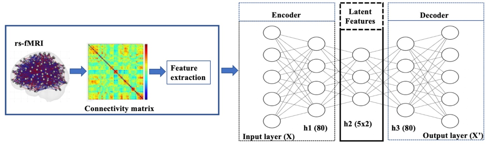
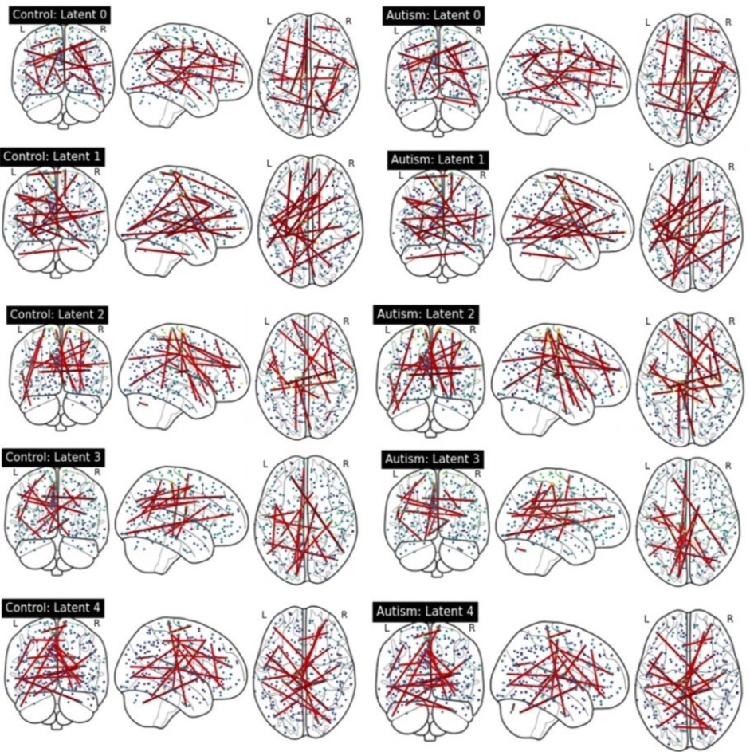

Explaining Deep Learning-Based Representations of Resting State Functional Connectivity Data: Focusing on Interpreting Nonlinear Patterns in Autism Spectrum Disorder 
=====================================

This repository provides a Python implementation of the methods presented in the paper "Explaining Deep Learning-Based Representations of Resting State Functional Connectivity Data: Focusing on Interpreting Nonlinear Patterns in Autism Spectrum Disorder". The codebase relies on PyTorch for deep learning tasks.

VAE Model Pipeline: The model is trained with rs-fMRI data, divided into training+validation (70%) and test (30%) sets. 20% of the training data is used for validation and tuning. After training, the model is tested to evaluate generalization. The VAE encodes brain features into latent representations.

Functional Connectivity Visualization: Displays the top 0.05% connections based on latent contribution scores. Each row indicates a component of the representation, while the columns show results for the control and autism groups.

## 1. Tutorial
### 1.1. Data preparation
Ensure processed rs-fMRI files are in the `data` folder with the structure:

data 
│ 
├── autism_age.npy 
├── autism_labels.npy 
├── autism_qc.npy 
├── autism_sex.npy 
├── autism_site.npy 
├── fmri_power_2011_cor.npy 
└── fmri_power_2011_cor_adj.npy 

For demonstration, we provide example synthetic data, composed of randomly chosen participants and added noise.

### 1.2. Experimental results
Implementation for VAE training and visualizations are available in `train.ipynb` and `visualization.ipynb`. A pre-trained model can be found under `vae_nets/power_2011_combat_h80_l5_r10_ep1000`.

## 2. Package dependencies
- matplotlib=3.5.1
- nilearn=0.10.1
- numpy=1.21.5
- pandas=1.3.5
- python=3.10.12
- seaborn=0.12.2
- scipy=1.8.0
- torch=2.0.1
- torchvision=0.15.1
- tqdm=4.40.0

## 3. License
This project is licensed under the terms of the MIT License. This means you can freely use, modify, and distribute the code, as long as you provide attribution to the original authors and source.

